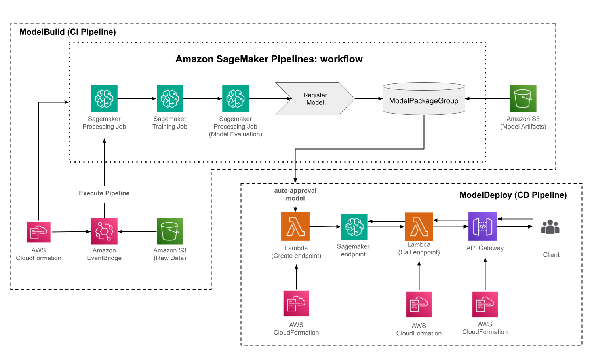

# AWS ML Model Deployment Architecture

This is a simple AWS architecture for building, training, and deploying a machine learning model. It is divided into two main parts: a CI pipeline for model building and a CD pipeline for deployment.



## 📁 Project Structure

Some folders may not be present in the repository, either due to size limits, restrictions, etc.

```bash
.
├── cdk
│   ├── api
│   ├── event
│   ├── lambdas
│   │   ├── call_endpoint
│   │   └── severless_deploy_endpoint
│   ├── pipeline
│   │   └── sagemaker
│   └── roles
│       ├── CallEndpoint
│       │   ├── attachedPolicies
│       │   └── inlinePolicies
│       ├── EventBridge_Invoke_SageMaker_Pipeline
│       │   ├── attachedPolicies
│       │   └── inlinePolicies
│       ├── ModelArtefacts
│       │   ├── attachedPolicies
│       │   └── inlinePolicies
│       ├── sagemakerS3
│       │   ├── attachedPolicies
│       │   └── inlinePolicies
│       └── TriggerS3UpdateTrainData
│           ├── attachedPolicies
│           └── inlinePolicies
├── experiments
│   ├── data
│   │   ├── processed
│   │   └── raw
│   ├── models
│   └── notebooks
│       └── tmp
├── other
│   └── img
├── pipeline
│   └── steps
└── test
    ├── integration
    └── unit

```
