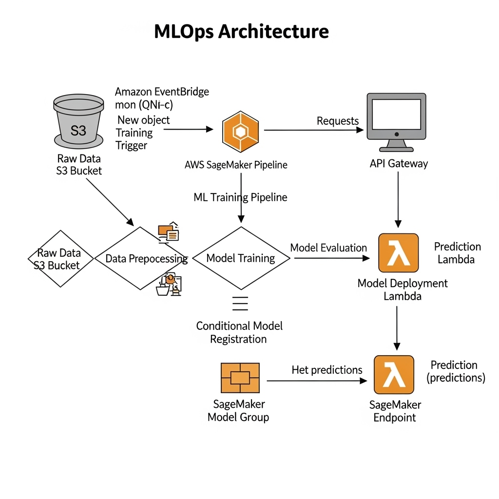

## 📁 Project Structure



```bash

.
├── cdk
│   ├── api
│   ├── event
│   ├── lambdas
│   │   ├── call_endpoint
│   │   └── severless_deploy_endpoint
│   └── pipeline
│       └── sagemaker
├── experiments
│   ├── data
│   │   ├── processed
│   │   └── raw
│   ├── models
│   └── notebooks
│       └── tmp
└── pipeline
    └── steps

```
